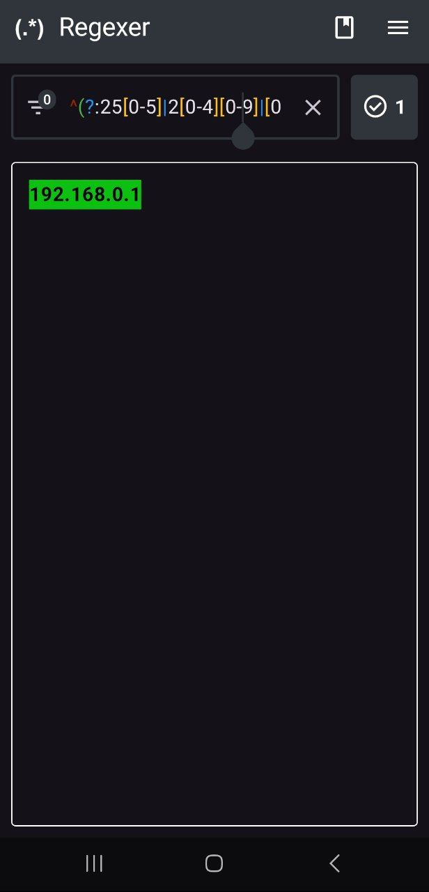
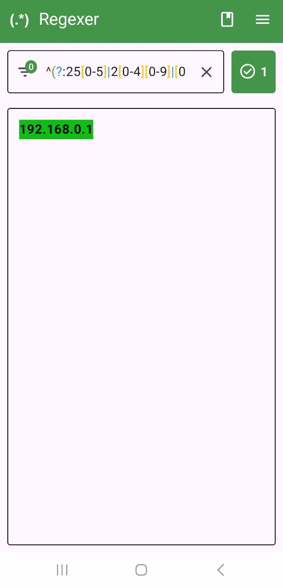

# Regexer
 A simple and easy-to-use Android app built in *Jetpack Compose* and based on Kotlin *Regex* library for testing regular expressions.📃

## Gallery
 Screenshots in light and dark themes.

 | Light | Dark |
 | :-----------: | :--------------: |
 |  |  |

## Used libs:
 * androidx datastore
 * viewmodel
 * colorpicker compose -> <a href="https://github.com/skydoves/colorpicker-compose">https://github.com/skydoves/colorpicker-compose</a>

## Todo✅
 1. UI improvement
 2. implementation of logic for saving regular expression patterns by user
 3. implementation of logic for loading text files from a device as test data for testing regular expression patterns
